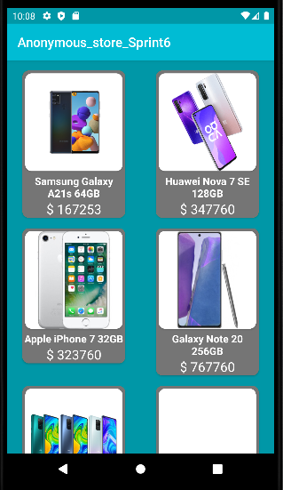
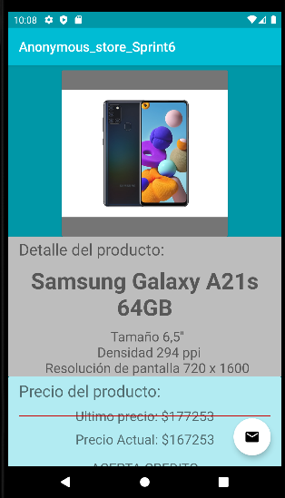

# Anonymous_store_Sprint6
# Descripción

Este proyecto es una aplicación Android desarrollada en Kotlin. La aplicación consiste en el despliegue de una lista de calzados llamada desde una API y cargado a una base de datos local. Al momento de hacer clic en un producto muestre el detalle y permita contactar al vendedor vía correo electrónico  .


## Consumo de API
Consume datos desde la API
```bash
https://my-json-server.typicode.com/Himuravidal/FakeAPIdata/
```

## Dependencia
- [Material Design](https://material.io/develop/android/docs/getting-started) - Utilidades de diseño
- [Retrofit](https://square.github.io/retrofit/) - Consumo de API
- [Coil](https://coil-kt.github.io/coil/) - Importar imágenes
- [Lifecycle](https://developer.android.com/jetpack/androidx/releases/lifecycle) - Respuesta segun ciclo de vida de los componentes
- [Room](https://developer.android.com/jetpack/androidx/releases/room) - Acceso a base de datos

## Capturas de pantalla
 


## Funcionamiento
- La aplicación inicia en la pantalla de RecyclerView con el listado de celulares cargadas desde el API.
- Al realizar click en un celular, esta muestra su información detallada.
- Al Hacer click en el Float Button del correo se despliega una pantalla donde se podra enviar un correo inmediatamente.
